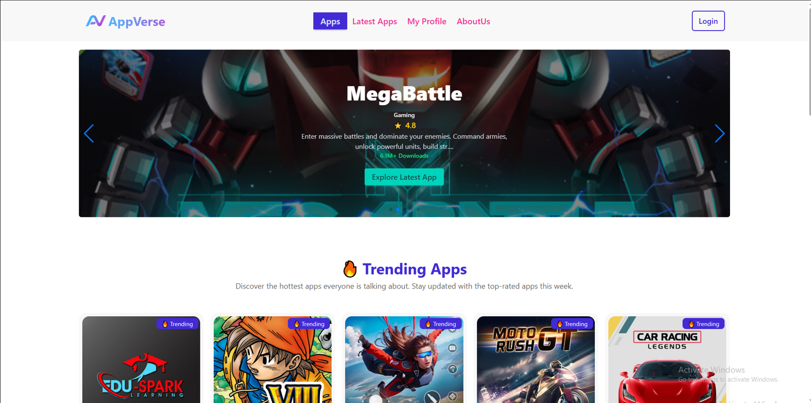

# 🌌 AppVerse - Discover, Install & Review Apps

**AppVerse** is a next-generation AppStore platform built with React where users can explore trending apps, browse by categories, install apps, and share their reviews. With a sleek and responsive design, AppVerse makes app discovery effortless and enjoyable.

---

## Home Page-


---

## 🚀 Live Website
👉 [Visit AppVerse Live Site](https://appverse-8230a.web.app/)

## 🗂️ GitHub Repository
👉 [View on GitHub](https://github.com/programming-hero-web-course1/b11a9-react-authentication-nurislam243)

---

## 🟣 Project Purpose
The purpose of **AppVerse** is to deliver a user-friendly and engaging app store experience that simplifies the process of discovering, installing, and managing apps. Users can explore trending apps, filter apps by categories like Education, Gaming, and Productivity, and share feedback through reviews. AppVerse aims to make app exploration seamless while encouraging user interaction.

---

## 🟠 Key Features

- 🔥 Browse and Discover Trending Apps
- 🎯 Filter Apps by Categories (Education, Gaming, Productivity)
- ✅ Secure User Authentication (Email/Password & Google Login)
- 🔒 Protected Routes using Firebase Authentication
- 🌟 Submit and View App Reviews with 5-Star Ratings
- 📱 Fully Responsive Design (Mobile, Tablet, Desktop)
- 🛠️ One-Click App Install/Uninstall Button Toggle
- ✍️ Edit User Profile (Update Name & Photo)
- 🚫 Custom 404 Not Found Page
- 🔗 Dynamic Routing with Dynamic Page Titles
- 🎉 Sweet Alert & Toast Notifications for Success/Error Messages
- 🚀 Fast Loading & SEO Friendly
- 🌐 Hosted on Firebase Hosting

---

## 🟢 Technologies Used (Core Technologies)

- **React JS** (Frontend Framework)
- **Tailwind Css** (Frontend Framework)
- **Firebase** (Authentication and Hosting)
- **CSS** (Styling)
- **JavaScript** (Programming Language)

---

## 📦 NPM Packages Used

- **React Router DOM** — For client-side routing
- **Firebase** — For authentication & hosting
- **Swiper JS** — For slider/carousel
- **DaisyUI** — For styled components (Tailwind plugin)
- **SweetAlert2** — For pop-up alerts
- **React Icons** — For using icons
- **Milify** — For formatting large numbers (downloads)
- **React Helmet Async** — For setting dynamic page titles
- **React Toastify** — For toast notifications

---

## 🟣 Pages & Routes

| Route                 | Page Description         | Access       |
| --------------------- | ------------------------ | ------------ |
| `/`                   | Home (All Apps Page)     | Public       |
| `/latest`             | Latest Apps Page         | Public       |
| `/appDetails/:appId`  | App Details Page         | 🔒 Protected |
| `/myProfile`          | My Profile Page          | 🔒 Protected |
| `/login`              | Login Page               | Public       |
| `/registration`       | Register Page            | Public       |
| `/aboutUs`            | About Us Page            | Public       |
| `/termsOfServices`    | Terms of Services Page   | Public       |
| `/privacyPolicy`      | Privacy Policy Page      | Public       |
| `/developerResources` | Developer Resources Page | Public       |
| `*`                   | 404 Not Found Page       | Public       |


---

## 🟡 JSON Data Example

The apps data is stored in JSON format, with fields like id, name, category, rating, downloads, and reviews.

```json
[
  {
    "id": "app001",
    "name": "ProgramHero",
    "developer": "Programming Hero Ltd.",
    "thumbnail": "https://i.ibb.co.com/VcZ3RS5x/web-thumbnail.webp",
    "banner": "https://i.ibb.co.com/kgJTQ4xT/programming-hero-banner.png",
    "downloads": 3500000,
    "category": "Education",
    "rating": 4.8,
    "description": "Learn programming in an interactive and fun way with Programming Hero.",
    "features": [
      "Interactive coding lessons",
      "Real-world projects",
      "Gamified learning experience"
    ],
    "reviews": [
      {
        "user": "coder_nadia",
        "rating": 5,
        "comment": "Best app for beginners!"
      }
    ]
  }
]

---

## ⚙️ Installation & How to Run Locally

### 🔧 Prerequisites
Ensure you have the following installed:
- Node.js (v16 or above)
- npm (comes with Node.js) or yarn
- Git
- Firebase project (for authentication and hosting)

---

### 📁 Clone the Repository

```bash
git clone https://github.com/nurislam243/AppVerse.git
cd AppVerse
```

### 📦 Install Dependencies


```bash
npm install
```

### 🔐 Setup Firebase

1. Go to the [Firebase Console](https://console.firebase.google.com/) and create a new project.
2. Add a web app to your project and copy the Firebase configuration.
3. Create a `.env` file in the root and add:
```env
VITE_apiKey=your_api_key
VITE_authDomain=your_auth_domain
VITE_projectId=your_project_id
VITE_storageBucket=your_storage_bucket
VITE_messagingSenderId=your_sender_id
VITE_appId=your_app_id
```
